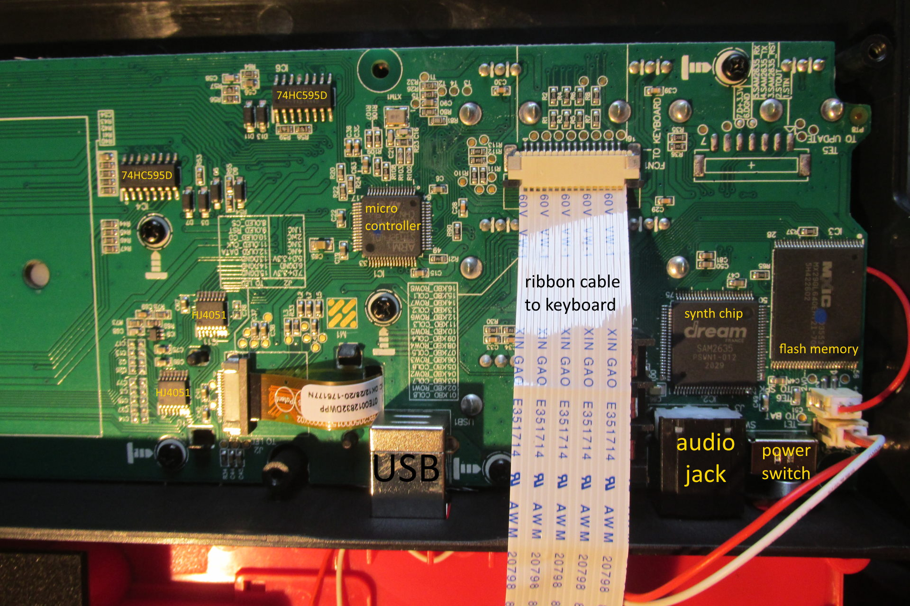

# guts of AKAI MPK mini play

*an attempt to enhance AKAI MPK mini play (OG version)*

I have an original AKAI MPK mini play keyboard. My feeling about it are little conflicted - I like it's simplicity, portable form factor and wide pallette of sounds. But there are some annoying things:

- I am not able to set velocity curve for keys (or set keys to full velocity)
- organ patches are velocity sensitive (which makes no sense)
- it's not possible to set BPM speed via numbers (only via tap tempo)
- in some patches reverb and chorus set to zero can mute the sound itself (not sure which patch it was or if this was just some momentary glitch)

Good thing that these things got fixed in later revisions of keyboard. But I don't want new hardware, **I want firmware update!**

I wish I was able to somewhat hack firmware in my unit. Even setting organ patches to full velocity would improve usage experience so much.

## what's inside

To be able to even think about custom/modded firmware I need to know what's inside. I [opened it up](https://eu.zonerama.com/metropolis/Album/8960874?secret=u03JYp4748Lv1Ct8512M3X45O) and identified those chips:

**DREAM FRANCE SAM2635** Low-Power Synthesizer with Effects and built-in CODEC - this is heart of the unit and it's responsible for all sound generation. Very interesting chip, see [datasheet](https://www.dream.fr/pdf/Serie2000/SAM_Datasheets/SAM2635.pdf).

**Macronix MX29GL640E H/L** Parallel NOR Flash memory. This probably stores ROM data for synhesizer chip and probably even user configuration. See [product page](https://www.mxic.com.tw/en-us/products/NOR-Flash/Parallel-NOR-Flash/Pages/spec.aspx?p=MX29GL640E%20H/L&m=Parallel%20NOR%20Flash&n=PM1494). Note - as my photos of this chip are little blury it's possible I misidentified this chip but I definitely got chip family right.

**STMicroeletronics STM32F401** microcontroller. This is probably responsible for communication over USB and overall coordiantion of keyboard's behaviour. See [product page](https://www.st.com/en/microcontrollers-microprocessors/stm32f401.html).

**74HC595D** shift register (at least two of these) and  Texas instruments **HJ4051** display driver, whole PCB for joystick and probably many more components which I omitted because I don't disassembled it all fearing I would not reassemble it again.

## see also

See Paul J. Drongowski [teardown](http://sandsoftwaresound.net/inside-akai-mini-play-mk1/) and later posts - he was even able to [modify it](http://sandsoftwaresound.net/akai-mpk-mini-play-gm-gs-midi-mod/) to have direct access to SAM2635 chip and turn it into multitimbral general MIDI synth (original MPK mini is NOT multitimbral).
